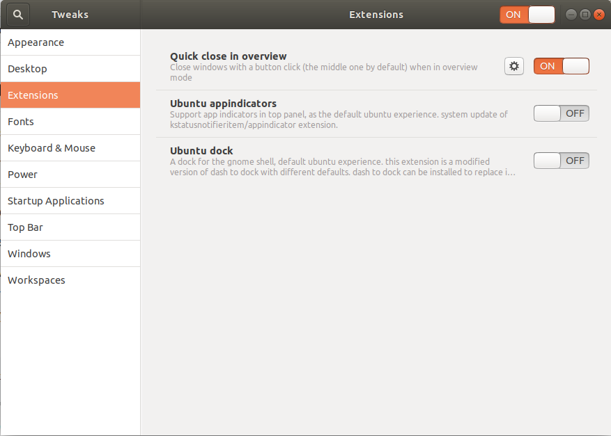

Middleclickclose
================

Gnome shell extension for closing apps in overview with a middle click

All credit goes to Paolo Tranquilli (http://cs.unibo.it/~tranquil/en/hacking.html), I've merely copied its code here to provide Gnome Shell 3.10+ compatibility

This extension is installable from https://extensions.gnome.org/extension/352/middle-click-to-close-in-overview/.

Otherwise you may

* download a [zip](https://github.com/p91paul/middleclickclose/archive/master.zip) of this extension
* extract it
* copy folder middleclickclose@paolo.tranquilli.gmail.com in $HOME/.local/share/gnome-shell/extensions
* run the following command

 ```
    glib-compile-schemas $HOME/.local/share/gnome-shell/extensions/middleclickclose@paolo.tranquilli.gmail.com/schemas
```

* reload gnome-shell (Alt-F2, r, Enter) -> on Wayland you need to log out and log in again, there is no in-place reload
* activate it through the Extensions gnome application.

